# MindfulConnect - Architecture Diagrams

## 📋 **Table of Contents**
1. [System Architecture Overview](#system-architecture-overview)
2. [Component Architecture](#component-architecture)
3. [Data Flow Diagrams](#data-flow-diagrams)
4. [Database Schema Diagram](#database-schema-diagram)
5. [Deployment Architecture](#deployment-architecture)
6. [Security Architecture](#security-architecture)
7. [AI Processing Pipeline](#ai-processing-pipeline)
8. [Real-time Communication Flow](#real-time-communication-flow)

---

## 🏗️ **System Architecture Overview**

---

## 🧩 **Component Architecture**

---

## 🔄 **Data Flow Diagrams**

### **Chat Message Flow**

### **Emergency Detection Flow**

### **Video Call Setup Flow**

---

## 🗄️ **Database Schema Diagram**

---

## 🚀 **Deployment Architecture**

---

## 🔒 **Security Architecture**

---

## 🤖 **AI Processing Pipeline**

---

## 📡 **Real-time Communication Flow**

---

## 🌐 **Multi-Language Processing Architecture**

```mermaid
graph TB
    subgraph "Language Detection"
        A[User Input] --> B[Language Identification]
        B --> C[Script Detection]
        C --> D[Regional Variant]
    end
    
    subgraph "Processing Pipeline"
        D --> E[Language-Specific Preprocessing]
        E --> F[Cultural Context Loading]
        F --> G[Emotion Keywords Mapping]
        G --> H[AI Model Selection]
    end
    
    subgraph "Response Generation"
        H --> I[Multilingual AI Processing]
        I --> J[Cultural Adaptation]
        J --> K[Regional Customization]
        K --> L[Response Formatting]
    end
    
    subgraph "Output Rendering"
        L --> M[Text Rendering]
        L --> N[Voice Synthesis]
        L --> O[UI Localization]
        M --> P[Font Selection]
        N --> Q[Voice Model Selection]
        O --> R[Layout Adjustment]
    end
    
    subgraph "Supported Languages"
        S[Hindi - हिन्दी]
        T[Bengali - বাংলা]
        U[Telugu - తెలుగు]
        V[Tamil - தமிழ்]
        W[Marathi - मराठी]
        X[Gujarati - ગુજરાતી]
        Y[Kannada - ಕನ್ನಡ]
        Z[Malayalam - മലയാളം]
    end
    
    H --> S
    H --> T
    H --> U
    H --> V
    H --> W
    H --> X
    H --> Y
    H --> Z
```

---

These architecture diagrams provide a comprehensive visual representation of the MindfulConnect platform's technical structure, data flows, and system interactions. Each diagram illustrates different aspects of the system to help developers, architects, and stakeholders understand the platform's complexity and design decisions.
